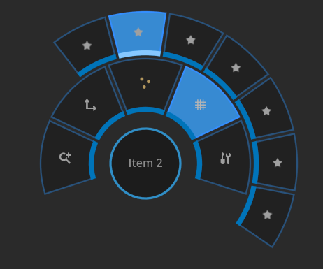
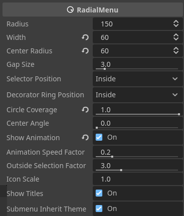

Radial Menu Control
===================

This project is based on [jesuisse/godot-radial-menu-control](https://github.com/jesuisse/godot-radial-menu-control), with modifications to add documentation and strong typing, as well as fixing some issues and missing functionality. Parts of it are compatible with previous installation in projects, but be warned, there are some breaking changes (mainly to variable names).

This code provides a radial menu control node for Godot Engine 4 (also called a "pie menu") with support for submenus:

	
It supports keyboard, mouse and gamepad input. You can define the basic look of the control using themes:

You can also change many menu geometry settings, such as how much of a full ring is covered by the menu, the radius and width of the ring/arc via exported properties:

A short demo video of the radial menu control is available at https://youtu.be/uATC5JfqUkI. A live demo is available at https://www.phar.ch/2024/godot-radial-menu-demo/RadialMenu.html

Setup
-----

There are two ways to set up your radial menu:
   
   1. Activate the RadialMenu *plugin* in your project settings and then add a radial menu to your scene tree using the new RadialMenu node that should become available with plugin activation.

   2. Preload the RadialMenu.gd Script in your script and then create a new RadialMenu
	  via script:

	# Preload the script and call it 'RadialMenu'
	const RadialMenu = preload("path_to/addons/RadialMenu/RadialMenu.gd")
	...
	# create a radial menu
	var menu = RadialMenu.new()

Note that adding children to the RadialMenu node currently has no effect, but this may change in later versions, so *do not add children to a radial menu* in your scene tree if you want to make sure later versions will still work.

The radial menu control node inherits from the builtin Control node, but acts like a popup. This means that you must provide some code to *open* the popup; the radial menu is hidden by default when you run the scene.

There are four Demo scenes under `addons/RadialMenu/Demo/RadialDemo[1234].tscn` with working radial menus, including one with submenus (Demo3).

The radial menu comes preconfigured with 7 dummy entries with star icons which you must reconfigure in order to make it usable. If your menu shows 7 star items, you've forgotten to configure the menu items.

Menu items are configured as a list of dictionaries:

	var items = [
	   {'texture': SOME_TEXTURE, 
		'title': 'A short title', 
		'id': 'anything, really'
	   },
	   ...
	]
	# assuming that menu references your RadialMenu node...
	menu.set_items(items)

The method `set_items` takes such a list and reconfigures the menu items. You can also manipulate the `menu_items`-property directly. 

If the value for an item's action key is a RadialMenu node, it will be treated as a **submenu** and opened when the menu item is activated. See `RadialDemo3.tscn` for an example.

Titles are shown in the center circle if there is enough space to display them and you haven't turned title display off.

Signals
-------

A radial menu control node emits five signals:

   1. `item_selected(id, position)`

   2. `item_hovered(menu_item)`

   3. `cancelled()`

   4. `menu_opened(menu)`

   5. `menu_closed(menu)`

The `item_selected` signal is emitted when a menu item is chosen and 
accepted via one of the supported input methods. `position` returns the original position at which the menu was opened via a call to `open_menu`.

The `item_hovered` signal is emitted when a menu item is selected but not yet
accepted as the user's choice; for example when the mouse first hovers over it.

The `cancelled` signal is emitted when the user closes the menu without having made a choice.

Configuration options
---------------------

Most of the geometry of the radial menu is configured directly via exported properties. The main parameters are the menu radius (always measured from the center to the the outermost edge) and the width of the ring which holds the items. The radial menu doesn't have to be a full ring; you can also configure it as an arc. The center of the arc can sit at any angle.

All colors, some size constants such as the width of the decorator ring/arc and the selector segment, the font and the close and default placeholder icon can be configured via themes. See the provided light and dark themes for an example. You can create a copy of these themes and drop your own copy in the `theme` property. See `RadialDemo2.tscn` for an example of how to override the dark default theme with the light default theme by setting the RadialMenu's `theme` property.

There is detailed documentation in editor for reference. This can be viewed by opening the documentation page for the **RadialMenu** class, or hovering over the exported properties in the inspector.

Input handling details
----------------------

The menu navigation reacts to some of the default actions Godot provides:
  
  `ui_cancel` closes a submenu or the main menu without choosing an item.
  `ui_accept` accepts the currently selected choice.
  `ui_focus_next` and `ui_focus_prev` select items clockwise and counterclockwise. `ui_down` and `ui_right` also select clockwise, `ui_up` und `ui_right` counterclockwise.

This takes care of both the keyboard and some of the gamepad navigation.

The mouse wheel also works to select items clockwise and counterclockwise. Moving the mouse back to the center deselects any selection made in the currently active menu; moving it far beyond the menu ring/arc also deselects. You can configure the radius at which deselection happens _outside_ the menu.

To configure gamepad input, you need to call the `setup_gamepad` method on every menu; the default settings let the first gamepad's two lowest-numbered axes control the item selection.

If you want to extend the RadialMenu class, you can override `_input` and call `_radial_input(event)` to get the default radial menu input handling when needed. 

UI considerations
-----------------

Don't pack more than a handful of items into a radial menu, especially when you don't cover the whole ring and when users use gamepads to select items, since it gets harder to select items as the selection angle narrows, and most people's brains have to actually work at processing more than, say, 5-7 items.

Also, currently stacking multiple radial submenus doesn't quite work (though it might in a later version, the code *almost* allows it); but this seems like a bad idea from a UI design standpoint. 

Finally, if you enable the menu animation, you should provide the user with a way to turn the animation off, because it _does_ slow down some people.

Plugin file structure
---------------------

The plugin does not have any third-party dependencies. This section is provided for those who want to trim the code down to the absolute minimum number of files required. 

   1. You *must* include the LICENSE file and, if you use the provided NotoSans-Regular.ttf font, the Noto-Sans-OFL.txt (it's license).

   2. The main work is done by the script `addons/RadialMenu/RadialMenu.gd`. It has several internal dependencies:  `drawing_library.gd` and `dark_default_theme.tres` are required. `dark_default_theme.tres` in turn requires `the NotoSans-Regular.ttf` font. You need to copy at least these four files into your own projects to get a working RadialMenu control. Also copy the `addons/RadialMenu/icons` folder or create your own and reference them in the theme. 

   3. `addons/RadialMenu/RadialMenu.tscn` is optional; it is only needed if you want to create RadialMenus by _instancing_ this scene.

   4. `addons/RadialMenu/radial_menu_plugin.gd` and `addons/RadialMenu/plugin.cfg` are there for plugin initialisation if you want to use the RadialMenu control via the Godot plugin system. Otherwise they are optional.

 All other files, including those under `addons/RadialMenu/Demo`, are optional. 

Known Bugs and Caveats
-----------------------

This is version 1.1. There are bound to be bugs. Please report bugs you encounter so they can be fixed.

The RadialMenu started life as a Popup in Godot 3, but is now a Control node, as Popup has been moved to another branch of the class tree in Godot 4, which is missing relevant functionality. So now there are positioning issues when you make the RadialMenu a child of a 
Control container. A workaround is to put a Node of class "Node" between the container and the RadialMenu; an example of how this works is given in Demo3.tscn.

License
-------

See the LICENSE file. The code is licensed to you under the MIT license. The License for the Noto Sans Regular TrueType-Font can be found in the 
Noto-Sans-OFL.txt` file.
